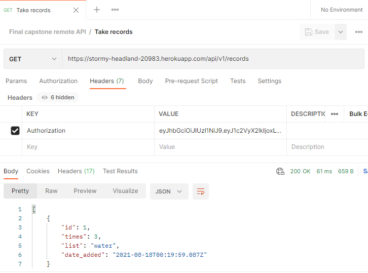

# Back-end track application (API service)

This app is the back-end for the final capstone on microverse program, to use it install [Postman](https://www.postman.com/) or another tool for API services (not supported on navigators).



## Live demo

[https://stormy-headland-20983.herokuapp.com/api/v1/](https://stormy-headland-20983.herokuapp.com/api/v1/)

## API documentation

[Click here to see it!](./docs/documentation/documentation.md)

## Tests with RSpec 

This website was tested with [Rspec](https://en.wikipedia.org/wiki/RSpec)

## 🔧 Built With these features
- Ruby 2.7.2
- Rails 6.1.4
- Bundle 2.1.4
- PostgreSQL 12.7
- Rubocop gem 1.19.0

## 🛠 Getting Started
## Install

```git clone https://github.com/vichuge/backend-track-app.git``` on your terminal.

## Run the application
To get a local copy up and running follow these simple example steps.

- Open a terminal
- Copy this code : ```git clone https://github.com/vichuge/backend-track-app.git```
- Run the program with this code : ```bundle install```
- before running ```rails server``` you must run a few more commands: first run ```yarn install --check-files```
- Then run ```rails db:create```, ```rails db:migrate```
- now you can run ```rails server```
- Stop the program with: "Ctrl + C" (Windows or Linux) or "Command + C"(Apple)

## Open app in browser

- When the program is running go to your browser.
- put: localhost:3000/
- Click on Sign Up, then register and create a new User
- Enjoy the app.

## ✒️ Author

👤 **Victor Pacheco**

- GitHub: [@vichuge](https://github.com/vichuge)
- LinkedIn: [LinkedIn](https://www.linkedin.com/in/victor-pacheco-7946aab2/)

## 🤝 Contributing
Contributions, issues and feature requests are welcome!

Feel free to check the [issues page](https://github.com/vichuge/backend-track-app/issues).

## Show your support

Give a ⭐️ if you like this project!

## 📝 License

This project is [MIT](./LICENSE) licensed.
